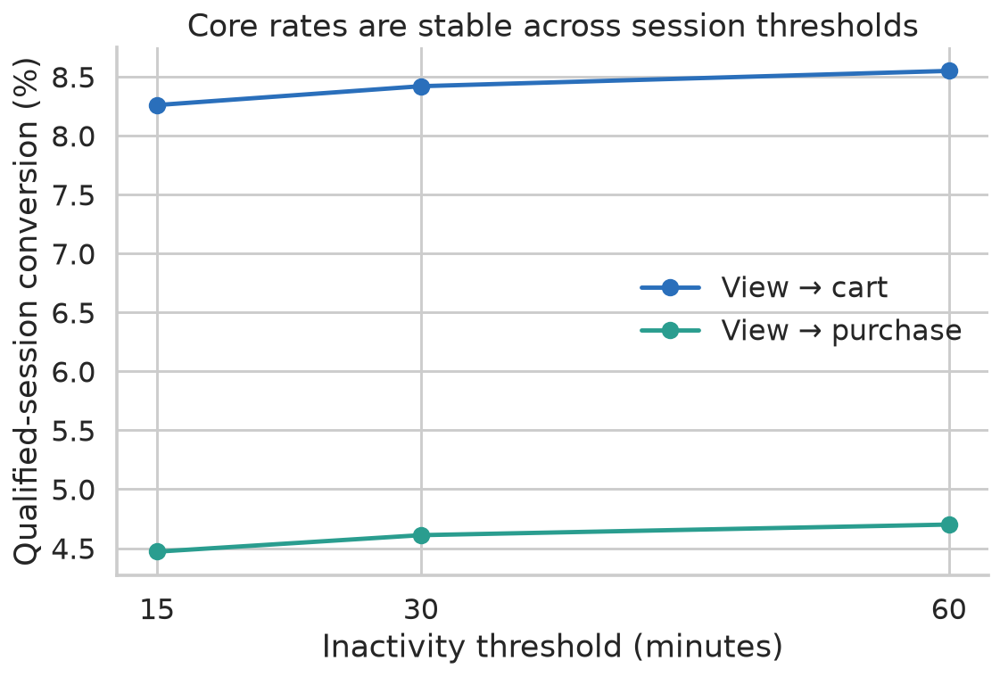
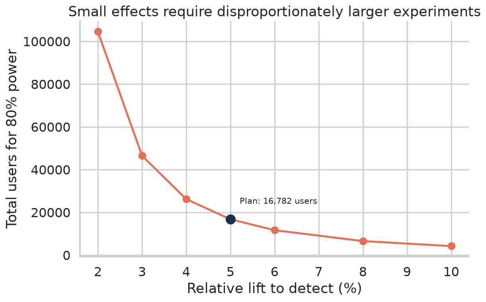
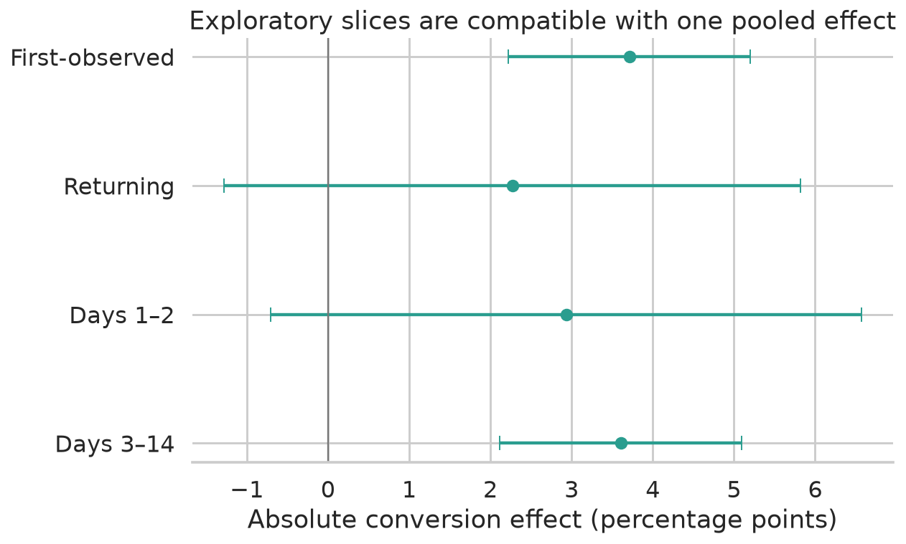

# ShopFlow: From Messy Events to a Trustworthy Product Experiment

## Executive summary

ShopFlow is a fictional product context built on a real, public, anonymised e-commerce event stream. The business question is intentionally concrete: **where should the product team intervene to improve qualified purchase conversion, and how would it know the change truly worked?**

The analysis begins with 885,129 raw view, cart, and purchase-item events from 407,283 observed users. It does not begin with a dashboard. The first discovery is that the supplied session identifier is not safe: IDs collide across users, thousands of user/session pairs cross dates, and the longest spans more than 150 days. After exact deduplication and user-level inactivity sessionisation, the canonical layer contains 884,474 events and 504,679 analytics sessions.

The main opportunity is a post-cart gap for expensive computer products. Highest-quartile products reach cart more often but complete less often. The pattern survives comparison within computers, alternative session boundaries, strict event order, same-product grain, calendar controls, and first/returning status. An adjusted model estimates Q4 cart-completion odds at 0.62 times Q1 odds (95% CI 0.58–0.67), while remaining explicitly associational.

Video cards combine the greatest cart volume, low completion, and highest scenario value gap. The team therefore prioritises a reversible purchase-confidence panel that surfaces compatibility, delivery, return, and payment information immediately after a qualifying add-to-cart.

Because the public source has no treatment assignment, the repository does not pretend it contains a real A/B test. Instead, it preregisters a design and creates a transparent synthetic experiment calibrated from real eligible-user covariates. The healthy run passes SRM and balance checks and estimates a +3.51 percentage-point conversion effect (95% CI +2.13 to +4.88). A second dataset deliberately loses treatment telemetry; its outcome is also significant, but SRM has `p < 1e-19`, so the result is rejected.

The final synthetic decision is a 25% staged launch with persistent control and guardrail monitoring. The real-world recommendation is more cautious: implement the event contract, conduct qualitative research, run a production A/A, and then run the preregistered user-randomised test.

## 1. Decision context

The fictional team initially asks a broad question: “How do we improve conversion?” That is not yet an analytical decision. The case translates it into four linked decisions:

1. Which part of the journey contains meaningful scale and a measurable gap?
2. Which segment should receive the first intervention?
3. Which mechanism and product response are plausible enough to test?
4. What evidence would justify launch, iteration, or rejection?

The north-star proxy is qualified-session purchase conversion: sessions with at least one purchase divided by sessions with at least one product view. It is deliberately called a proxy because the source is not the entire company funnel and does not contain acquisition, order fulfilment, margin, or customer satisfaction.

## 2. Data source and truth boundaries

The observational backbone is the REES46 electronics-store event dataset covering 2020-09-24 through 2021-02-28. Its useful fields are event timestamp/type, product, category, brand, price, user, and source session.

Its limitations materially shape the analysis:

- no audited order identifier;
- no documented currency contract, tax, discount, shipping, or margin;
- no refund, cancellation, fulfilment, or stock status;
- no checkout steps, payment errors, device, geography, or acquisition source;
- 26.7% unknown category code and 24.0% unknown brand at the event grain;
- left-censored user history and right-censored return windows.

For that reason, summed purchase prices are called **observed purchase-item value**, and first appearance is called **first observed**, never acquired/new customer.

## 3. Measurement audit

### 3.1 Exact duplicates

The raw file contains 655 exact duplicate rows. Only exact duplicates are removed. Repeated behaviours with different timestamps remain because rapid repeated events may be real or may reflect a separate instrumentation problem that cannot be resolved without an event ID.

### 3.2 Session identity

The source-session key fails basic identity checks:

- 214 session strings map to multiple users;
- 14,070 user/session pairs cross a date boundary;
- 162 canonical events have no source-session ID;
- the longest source session exceeds 150 days.

The canonical pipeline creates a new session after more than 30 minutes of user inactivity. Source IDs remain available for audit but never define KPI denominators.

### 3.3 Session threshold sensitivity

Sessionisation is an assumption, so the project recomputes the core funnel at 15, 30, and 60 minutes.

| Timeout | Sessions | View→cart | View→purchase |
|---|---:|---:|---:|
| 15 minutes | 518,944 | 8.26% | 4.47% |
| 30 minutes | 504,679 | 8.42% | 4.61% |
| 60 minutes | 494,301 | 8.55% | 4.70% |

The rate movement is modest. Longer thresholds merge more behaviours and mechanically raise conversion, but the business diagnosis does not reverse.

## 4. Funnel diagnosis

The canonical 30-minute funnel contains 503,168 qualified sessions, 42,374 cart sessions, and 23,218 purchase sessions. View-to-cart is 8.42%; view-to-purchase is 4.61%.

This aggregate result is not yet actionable. It says many visits do not reach cart but does not tell the team where product effort can influence qualified intent.

### 4.1 Grain and order

Three definitions answer different questions:

| Definition | Viewed | Carted | Purchased | Cart→purchase |
|---|---:|---:|---:|---:|
| Session, any event order | 503,168 | 42,374 | 21,794 | 51.43% |
| Session, ordered events | 503,168 | 42,059 | 21,601 | 51.36% |
| Session-product, ordered events | 644,699 | 49,502 | 23,595 | 47.66% |

Event ordering barely changes the session result. Requiring the same product lowers completion by 3.77 points, showing that loose session matching overstates journey continuity. Product decisions about a specific cart item therefore use the strict session-product mart.

The analysis also preserves 2,969 purchase-without-cart and 645 cart-without-view session-products. They may indicate cross-session consideration, direct-buy flows, missing telemetry, or boundary artefacts. Deleting them would make the funnel cleaner but less truthful.

## 5. Segment discovery

### 5.1 Price pattern

| Price quartile | Viewed session-products | Ordered carts | View→cart | Cart→purchase |
|---|---:|---:|---:|---:|
| Q1 | 161,470 | 10,189 | 6.31% | 55.17% |
| Q2 | 161,060 | 11,359 | 7.05% | 52.56% |
| Q3 | 161,130 | 11,136 | 6.91% | 45.37% |
| Q4 | 161,039 | 16,818 | 10.44% | 41.34% |

Q4 creates carts 65% more often than Q1 while completing 13.8 points less often. The useful interpretation is not that Q4 users lack intent: their cart action demonstrates intent. The opportunity lies between demonstrated intent and completion.

### 5.2 Within-category check

Computers are both the largest category and heavily represented in Q4, so aggregate price could simply be category mix. Within computers, however, completion still declines monotonically:

- Q1: 55.24%
- Q2: 48.69%
- Q3: 43.18%
- Q4: 41.16%

Video cards alone contribute 11,713 ordered carts and 4,697 ordered purchases, a 40.10% completion rate. CPUs, motherboards, monitors, and power supplies also sit below the portfolio benchmark.

### 5.3 Adjusted association

A logistic model uses the 49,502 already-carted session-products, clusters standard errors by user, and controls for broad category, calendar month, and first/returning status.

| Quartile versus Q1 | Adjusted OR | 95% CI |
|---|---:|---:|
| Q2 | 0.90 | 0.84–0.95 |
| Q3 | 0.69 | 0.65–0.74 |
| Q4 | 0.62 | 0.58–0.67 |

This does not make price causal. Conditioning on cart selects users after a behavioural event, and stock, promotion, shipping, and payment variables are missing. The model's pseudo-R² is only 0.016, which is a warning that observed fields explain little individual behaviour.

### 5.4 Timing and alternative intent story

Q4 reaches cart in a median 41 seconds versus 49 seconds for Q1. Among purchasers, Q4 reaches purchase in 78 seconds after cart versus 96 seconds for Q1. Expensive-product buyers who complete are not uniformly slow or indecisive.

One plausible interpretation is a polarised journey: decisive Q4 buyers act quickly, while a larger remaining group exits after cart. This supports testing post-cart information, but does not identify which information matters.

## 6. Lifecycle and time

Only 45,800 of 407,283 observed users have more than one reconstructed session. Naive 30-day return is 10.47%. Restricting to 331,649 users with a full 30-day observation horizon raises it to 10.73%.

Monthly qualified conversion rises from 3.97% in October to 5.20% in January and 5.13% in February. September is partial. Seasonality, assortment, marketing, or instrumentation can explain the change; month is therefore treated as a control, not a product success claim.

## 7. Opportunity sizing without pretending to forecast

A scenario ranking asks what the observed gap would look like if each sufficiently large subcategory reached the strict portfolio completion benchmark of 47.66%.

For video cards, the mathematical gap is approximately 885 item purchases and 351,935 source-value units on observed cart volume. CPUs rank second at about 259 purchases and 52,860 units.

This is not an incremental forecast. It ignores causal effectiveness, substitution, refunds, margin, capacity, and whether the benchmark is achievable for each product mix. Its purpose is prioritisation: video cards deserve the first investigation because scale and gap coincide.

## 8. Root-cause hypotheses

Clicks cannot reveal why the user leaves. Seven explanations remain live:

1. compatibility uncertainty;
2. price or payment anxiety;
3. delivery or return uncertainty;
4. stock or fulfilment failure;
5. cart used as wishlist/comparison storage;
6. promotion or brand mix;
7. checkout performance or errors.

The production instrumentation plan adds assignment, requested/rendered exposure, checkout starts, shipping quotes, payment attempts, stable error codes, orders, cancellations, and refunds. Qualitative sessions ask how users interpret cart and what information is missing at the decision point.

## 9. Product option selection

Six options are scored on reach, expected impact, evidence confidence, and effort/risk. A broad discount ranks poorly because it changes economics, has weak mechanism evidence, and introduces margin risk. A complete compatibility checker has a strong mechanism but high implementation effort and requires a reliable product graph.

The purchase-confidence panel ranks first because it reaches the eligible population, is reversible, can separately instrument message interactions, and creates learning before a larger build. It bundles compatibility, delivery, returns, and payment information; a win would still require a component follow-up.

## 10. Preregistered experiment

- Unit: user.
- Eligibility: first qualifying session with ordered view→cart for a computer product above 176.17 source units.
- Assignment: stable 50/50 control/treatment.
- Primary: same-product purchase per assigned eligible user.
- Secondary: purchase-item value per eligible user, including zero.
- Guardrails: checkout latency and error-user rate.
- Runtime: 14 complete days.
- Decision sample: at least 16,782 users for a 5% relative MDE at 80% power.
- Analysis: intention-to-treat with a Newcombe interval for the binary effect and Welch interval for value.

Detecting a 2% relative lift would require 104,546 users. The curve prevents a team from interpreting an underpowered null as proof of no useful effect.

## 11. Experiment validation

### 11.1 A/A calibration

Across 5,000 simulated null experiments with 5,000 users per arm, the observed false-positive rate is 5.18% at nominal alpha 5%. Mean effect is approximately zero and p-value deciles are close to uniform. This validates the analysis implementation under its assumptions; it does not replace a live A/A of production assignment and telemetry.

### 11.2 Pre-period leakage correction

An intermediate implementation accidentally counted the qualifying session as historical because the session began before the qualifying cart timestamp. That made almost every user look returning and exaggerated the apparent usefulness of the pre-period covariate.

The corrected logic explicitly excludes the eligible session. It identifies 8,233 of 9,742 real eligible users as having no prior session. A regression test freezes this expectation. After correction, CUPED variance reduction falls to only 0.26%—a more credible result for sparse user history.

### 11.3 SRM sensitivity

At 10,000 intended users per arm, 1–2% differential treatment telemetry loss does not cross the strict `p < 0.001` SRM threshold, while 5% loss does. SRM is therefore necessary but not sufficient; assignment/outcome join rates, missingness, and cross-variant exposure are also required.

## 12. Synthetic readout

The healthy generated run contains 10,033 control and 9,967 treatment users. SRM has `p = 0.641`, and maximum absolute pre-period SMD is 0.008.

| Metric | Control | Treatment | Effect | 95% CI |
|---|---:|---:|---:|---:|
| Same-product conversion | 43.05% | 46.55% | +3.51 pp | +2.13 to +4.88 pp |
| Purchase-item value / eligible user | — | — | +12.50 | +7.92 to +17.08 |
| CUPED-adjusted value | — | — | +12.56 | +7.99 to +17.14 |
| Checkout latency | — | — | +17.48 ms | +12.75 to +22.22 ms |

Latency movement is statistically detectable but remains below the prespecified +50 ms guardrail. Error rate moves from 0.65% to 0.75%, below the +0.20-point threshold but worth monitoring.

First-observed and returning estimates differ numerically, but the interaction has `p = 0.448`. Days 1–2 and days 3–14 also differ numerically, but their interaction has `p = 0.733`. The analysis correctly avoids claiming heterogeneity from “significant here, not significant there.”

## 13. Broken telemetry drill

The red-team dataset loses treatment records more frequently, leaving 9,988 control and 8,742 treatment users. It still produces a favourable and statistically significant conversion estimate.

SRM has `p < 1e-19`. The readout stops. No launch decision is made from that estimate. The product lesson is more important than the simulated number: a statistically convincing outcome can be operationally invalid.

## 14. Decision and rollout

For the healthy synthetic case, the rule supports a 25% staged launch:

1. preserve a persistent control;
2. monitor assignment, render coverage, latency, errors, and checkout steps daily;
3. follow orders through cancellation/refund maturity;
4. do not generalise to cheap products or other categories;
5. run a component experiment if the bundle effect persists.

For a real organisation, the next action is not to claim this lift. It is to implement the data contract, conduct five to eight targeted qualitative sessions, validate the system with A/A, and then run the preregistered experiment.

## 15. What this case demonstrates

The portfolio signal is not the number of charts. It is the ability to:

- find and repair identity/session defects before KPI work;
- distinguish session, product, user, and order grains;
- quantify censoring and sensitivity;
- preserve inconvenient path exceptions;
- challenge a segment result with within-category and adjusted analyses;
- move from association to falsifiable product hypotheses;
- preregister estimands, thresholds, and failure conditions;
- detect leakage and accept weaker corrected results;
- reject a significant but invalid experiment; and
- translate evidence into an operational product decision with explicit limits.
