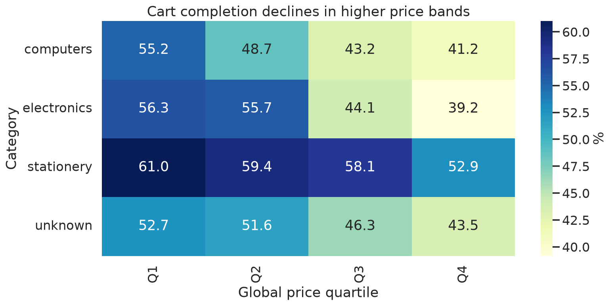
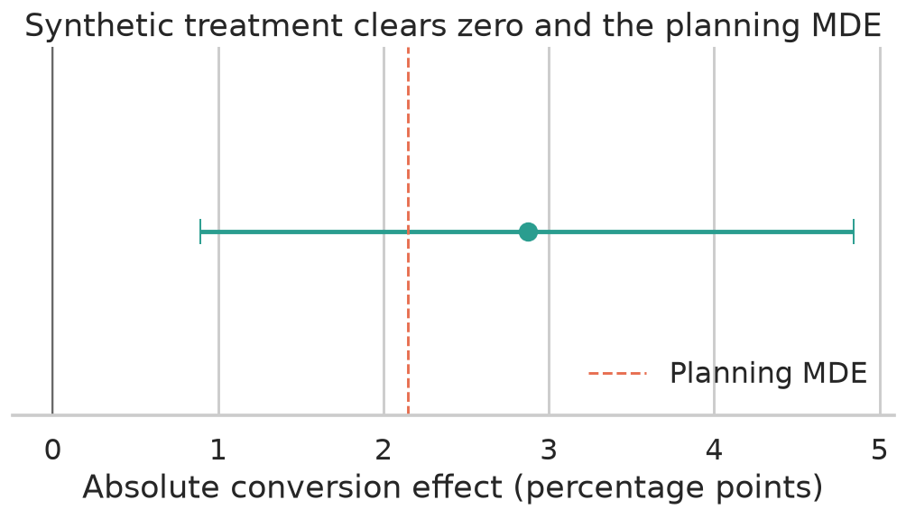
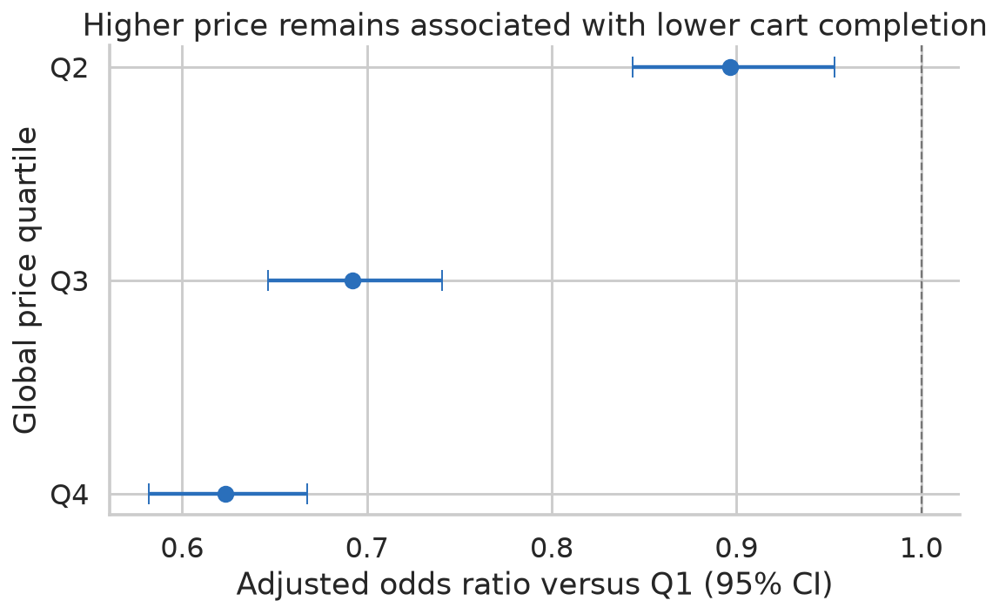

# ShopFlow Product Analytics & Experimentation

An end-to-end product analytics case study using 884k anonymised e-commerce events to audit measurement, reconstruct journeys, test competing explanations, prioritise a product intervention, and demonstrate a trustworthy experiment readout.

> **Status:** complete and reproducible portfolio case study.

**[Open the interactive product analytics dashboard](https://thvh2006.github.io/shopflow-product-analytics/)** ·
[Full case study](CASE_STUDY.md) ·
[Experiment preregistration](docs/experiment_preregistration.md)

## Decision questions

1. Where does the product journey lose the most qualified intent?
2. Which user, category, price, and behavioural segments show the largest opportunity?
3. What product change should be tested first?
4. Is the proposed experiment design trustworthy and adequately powered for a real launch test?

## Executive decision

Prioritise users who add a high-price computer product to cart. Test a compact
purchase-confidence panel covering compatibility, delivery, returns, and payment
protection. The synthetic run is now treated strictly as a pipeline test: it does
**not** authorize rollout. A real decision requires at least 16,782 unique eligible
users, live A/A validation, and outcomes not generated from an injected effect.

This decision follows an evidence chain rather than a single chart:

| Decision step | Evidence | What it does **not** prove |
|---|---|---|
| Locate the gap | Q4 has 10.44% view→cart but 41.34% cart→purchase | Price causes abandonment |
| Reduce mix confounding | Within computers, completion falls from 55.24% in Q1 to 41.16% in Q4 | The mechanism is psychological reassurance |
| Adjust measured factors | Q4 adjusted odds ratio is 0.62 versus Q1 after category, month, and user-status controls | Unmeasured stock, promotion, or fulfilment is absent |
| Quantify opportunity | Video cards dominate cart volume and scenario value gap | The full gap is recoverable |
| Choose a reversible test | Confidence panel has better reach/learning-to-effort than six alternatives | Each panel component is independently effective |
| Validate the decision system | Power, A/A, SRM, balance, CI, CUPED, guardrails, and temporal interactions | An injected synthetic effect validates product impact |

## Analytical standard

The project separates observational evidence from causal claims. The event dataset
contains no random assignment, so it is never presented as an A/B test. Experiment
records use each eligible source user at most once, are generated by published code,
and expose the injected 0.12 log-odds effect in both data and outputs. The synthetic
readout validates analysis behaviour—not the proposed feature.

The analysis also treats metric definitions as assumptions to test. Session timeout, event ordering, product grain, observation maturity, missing dimensions, and pre-period leakage are audited explicitly.

## What the project demonstrates

- Reproducible event ingestion and sessionisation pipeline.
- Event taxonomy, metric tree, and data-quality tests.
- Funnel, retention, path, and segment analyses.
- Insight log connecting evidence to product hypotheses.
- Pre-experiment design with MDE, power, and guardrails.
- Experiment generator with treatment/control and pre-period covariates.
- SRM, balance, confidence interval, CUPED, and novelty checks.
- Portfolio figures, experiment readout, and a no-launch evidence decision.
- Session-threshold and funnel-definition sensitivity.
- User-clustered adjusted completion model and scenario opportunity ranking.
- Root-cause hypothesis matrix, solution scoring, and production instrumentation contract.
- A/A calibration, power curve, SRM sensitivity, heterogeneity interaction tests, and a deliberately invalid experiment.

## Headline findings

- The source session identifier is not analytically safe: 214 IDs cross users and 14,070 user-session pairs cross dates. The pipeline reconstructs 504,679 sessions using a 30-minute inactivity rule.
- The highest price quartile has the strongest view-to-cart rate (10.44%) but the weakest cart-to-purchase rate (41.34%).
- The pattern persists within computers: completion declines from 55.24% in Q1 to 41.16% in Q4.
- Video cards combine the greatest cart volume with only 40.10% cart completion, motivating a purchase-confidence experiment for high-price computer carts.
- Session timeout sensitivity is small: view→purchase ranges from 4.47% to 4.70% under 15/30/60-minute definitions.
- Moving from loose session matching to ordered same-product matching lowers cart completion from 51.43% to 47.66%, showing why grain matters.
- After category, calendar month, and first/returning controls, Q4 still has 37.7% lower purchase odds than Q1 (OR 0.62, 95% CI 0.58–0.67). This is association, not a causal price effect.
- Q4 reaches cart faster than Q1 (median 41 versus 49 seconds) despite lower completion, weakening a simple “low initial intent” explanation.
- A 5% relative experiment lift needs 16,782 total users; a 2% lift needs 104,546. A/A simulation recovers a 5.18% false-positive rate at nominal 5% alpha.
- The 9,742-user synthetic run uses every eligible user once: zero duplicated source
  users. Conversion rises from 43.71% to 46.58% (+2.87 points; 95% CI +0.90 to
  +4.84), but that result is mechanically downstream of the injected effect.
- The available unique population is 7,040 users short of the 16,782-user planning
  floor for a 5% relative MDE; the portfolio does not turn a significant synthetic
  p-value into a launch recommendation.
- In the deliberately broken telemetry run, SRM has `p < 5e-8`; its apparently
  significant effect is correctly rejected as uninterpretable.







## Case-study flow

### 1. Audit before metrics

The raw source-session key collides across users and can span months. The pipeline removes only 655 exact duplicate rows, preserves unknown categories/brands as visible segments, and reconstructs 504,679 user sessions with a 30-minute inactivity rule. Purchase-row price is labelled observed purchase-item value because order ID, currency contract, tax, shipping, refund, and cancellation fields are unavailable.

### 2. Diagnose at multiple grains

The qualified-session funnel answers whether a shopping visit converts. The strict session-product funnel requires timestamp-ordered view → cart → purchase for the same product. Path exceptions—2,969 purchase-without-cart and 645 cart-without-view session-products—stay visible rather than being forced into a neat funnel.

### 3. Challenge the first explanation

Price segmentation is repeated inside broad category, then tested with a user-clustered logistic model controlling category, calendar month, and first/returning status. Three session thresholds, two session definitions, a strict product grain, mature return denominators, timing distributions, and month trends are compared.

### 4. Convert the gap into product choices

A root-cause matrix keeps compatibility, payment, delivery, stock, wishlist behaviour, promotion, and technical errors alive as alternatives. Six interventions are scored on reach, impact, evidence confidence, and effort/risk. The selected panel maximises learning per unit of implementation effort; it is not claimed to be the only solution.

### 5. Preregister before outcomes

The design freezes unit, eligibility, assignment, primary metric, secondary value metric, latency/error guardrails, MDE, runtime, trust checks, and decision thresholds. A production event contract separates assignment, requested treatment, rendered exposure, checkout steps, errors, orders, and later cancellation/refund outcomes.

### 6. Try to invalidate the experiment

The readout checks SRM and pre-period balance before outcomes, reports confidence intervals and practical thresholds, quantifies weak CUPED benefit, tests returning-user and early-day interactions, and runs a broken telemetry scenario. Statistical significance never overrides invalid assignment or data loss.

## Repository map

- `reports/01_data_audit.md`: what can and cannot be trusted.
- `reports/02_product_insights.md`: diagnosis, alternatives, and prioritised hypothesis.
- `docs/experiment_preregistration.md`: population, metrics, power, guardrails, and decision rule.
- `reports/03_experiment_readout.md`: effect estimates, CUPED, guardrails, power gap,
  and why the simulation cannot authorize rollout.
- `reports/04_robustness_and_alternatives.md`: session/grain sensitivity, mature cohorts, adjusted model, and scenario ranking.
- `docs/research_synthesis.md`: measurement and experimentation research translated into project decisions.
- `docs/root_cause_hypotheses.md`: competing explanations and evidence needed to distinguish them.
- `docs/solution_prioritisation.md`: six intervention options and explicit scoring assumptions.
- `docs/instrumentation_spec.md`: production assignment, exposure, checkout, order, and quality contracts.
- `sql/`: canonical event, product mart, and opportunity logic.
- `src/analysis/`: adjusted completion model and scenario opportunity ranking.
- `src/experimentation/`: fully labelled synthetic generator and analysis.
- `tests/`: reconciliation, metric invariants, reproducibility, and SRM detection.
- `.github/workflows/ci.yml`: clean rebuild, checksum verification, tests, and lint on every push.

## Reproduce locally

Use Python 3.12. Download the compressed source file to `data/raw/electronics-events.csv.gz`, create a virtual environment, and install the project dependencies. Then run:

```bash
python -m src.ingestion.download_data
python -m src.ingestion.build_event_database
python -m src.ingestion.build_analytics_marts
python -m src.ingestion.build_opportunity_marts
python -m src.ingestion.build_robustness_marts
python -m src.analysis.cart_completion_model
python -m src.experimentation.validate_design
python -m src.experimentation.simulate_experiment --scenario healthy
python -m src.experimentation.simulate_experiment --scenario srm
python -m src.experimentation.analyze_experiment --scenario healthy
python -m src.experimentation.analyze_experiment --scenario srm
python -m src.reporting.build_figures
pytest
```

Or, after creating `.venv` and installing dependencies, run `make all` to download and verify the source, rebuild every mart, generate both experiment scenarios and figures, and execute quality checks.

Open `dashboard/index.html` for the self-contained reviewer dashboard.

Raw and processed data are intentionally excluded from Git. Generated figures and compact statistical summaries are included for review.

## Honest limitations

- The public source has no checkout steps, order ID, promotion, inventory, acquisition channel, geography, device, refund, margin, or qualitative feedback.
- “First observed” is not verified acquisition; observed return is not true retention.
- The adjusted model conditions on cart and remains vulnerable to unmeasured confounding and selection.
- Scenario opportunity value is a benchmark gap, not a forecast.
- The fictional treatment and every post-assignment outcome are synthetic. They demonstrate method, not real impact.
- The simulation injects a positive treatment effect by construction; detecting it
  is a pipeline check, not evidence about the product hypothesis.
- The selected bundle cannot identify which reassurance component matters without a follow-up component experiment.

## Data source

The observational source is the free REES46 electronics-store behaviour dataset. It contains anonymised `view`, `cart`, and `purchase` events with product, user, and source-session identifiers. Raw data is ignored by Git.

- Official catalogue: https://rees46.com/en/datasets
- Direct data catalogue: https://data.rees46.com/
- Kaggle data card: https://www.kaggle.com/datasets/mkechinov/ecommerce-events-history-in-electronics-store

ShopFlow is a fictional case-study context. The source records are not represented as data from a named real company.
